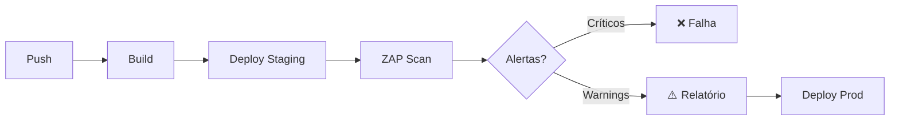
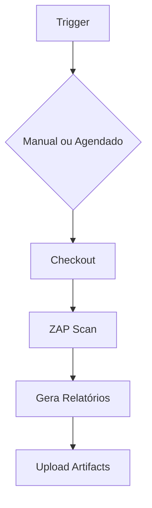

# 🎬 Vídeo 5.2 - Automatização com ZAP

**Aula**: 5 - DAST com OWASP ZAP  
**Vídeo**: 5.2  
**Temas**: ZAP no pipeline; Rules file; Relatórios; GitHub Actions

---

## 📚 Parte 1: ZAP no Pipeline

### Passo 1: Fluxo de DAST no CI/CD



**Pontos importantes:**
- DAST precisa da aplicação **rodando**
- Executar **após** deploy em staging
- Pode ser agendado (não a cada push)

---

### Passo 2: Estratégias de Execução

| Estratégia | Quando | Vantagem |
|------------|--------|----------|
| **A cada PR** | Pull Request | Feedback rápido |
| **Agendado** | Noite/fim de semana | Não bloqueia |
| **Manual** | workflow_dispatch | Sob demanda |

> 💡 Recomendação: Agendado + Manual para começar

---

## 📝 Parte 2: Arquivo de Regras

### Passo 3: O que é rules.tsv?

**Rules file** = Configuração de como tratar cada alerta

**Formato:** `ID<TAB>ACTION<TAB>DESCRIPTION`

**Actions disponíveis:**

| Action | Comportamento |
|--------|---------------|
| `IGNORE` | Ignora o alerta |
| `WARN` | Alerta mas não falha |
| `FAIL` | Falha o pipeline |

---

### Passo 4: Criar Rules File

**Linux/Mac:**
```bash
cd ~/fiap-devsecops/fiap-dclt-devsecops-aula05

# Criar diretório
mkdir -p .zap

# Criar arquivo de regras
cat > .zap/rules.tsv << 'EOF'
# ZAP Rules Configuration
# Formato: ID	ACTION	DESCRIPTION
10010	WARN	Cookie No HttpOnly Flag
10011	WARN	Cookie Without Secure Flag
10015	WARN	Incomplete or No Cache-control Header
10021	WARN	X-Content-Type-Options Header Missing
10038	WARN	Content Security Policy (CSP) Header Not Set
10098	WARN	Cross-Domain Misconfiguration
90022	WARN	Application Error Disclosure
EOF
```

**Windows (PowerShell):**
```powershell
cd ~\projetos\fiap-dclt-devsecops-aula05

# Criar diretório
New-Item -ItemType Directory -Force -Path .zap

# Criar arquivo de regras
@"
# ZAP Rules Configuration
10010	WARN	Cookie No HttpOnly Flag
10011	WARN	Cookie Without Secure Flag
10015	WARN	Incomplete or No Cache-control Header
10021	WARN	X-Content-Type-Options Header Missing
10038	WARN	Content Security Policy (CSP) Header Not Set
10098	WARN	Cross-Domain Misconfiguration
90022	WARN	Application Error Disclosure
"@ | Out-File -FilePath .zap/rules.tsv -Encoding UTF8
```

---

## 🔄 Parte 3: Workflow DAST

### Passo 5: Criar Workflow

**Linux/Mac:**
```bash
cd ~/fiap-devsecops/fiap-dclt-devsecops-aula05
mkdir -p .github/workflows

cat > .github/workflows/dast.yml << 'EOF'
# ============================================
# WORKFLOW: DAST com OWASP ZAP
# ============================================
name: 🔍 DAST Scan

on:
  # Execução manual
  workflow_dispatch:
  
  # Agendado: Segunda às 2h
  schedule:
    - cron: '0 2 * * 1'

jobs:
  # ============================================
  # JOB: ZAP Baseline Scan
  # ============================================
  zap-baseline:
    name: 🕷️ OWASP ZAP
    runs-on: ubuntu-latest
    
    steps:
      - name: 📥 Checkout
        uses: actions/checkout@v4

      - name: 🕷️ ZAP Baseline Scan
        uses: zaproxy/action-baseline@v0.12.0
        with:
          target: ${{ secrets.STAGING_URL }}
          rules_file_name: '.zap/rules.tsv'
          cmd_options: '-a'

      - name: 📤 Upload HTML Report
        uses: actions/upload-artifact@v4
        if: always()
        with:
          name: zap-report-html
          path: report_html.html
          retention-days: 30

      - name: 📤 Upload JSON Report
        uses: actions/upload-artifact@v4
        if: always()
        with:
          name: zap-report-json
          path: report_json.json
          retention-days: 30
EOF
```

---

### Passo 6: Entender o Workflow



**Parâmetros importantes:**

| Parâmetro | Descrição |
|-----------|-----------|
| `target` | URL da aplicação (secret) |
| `rules_file_name` | Arquivo de regras |
| `cmd_options: '-a'` | Ajax spider habilitado |

---

### Passo 7: Commit e Push

**Linux/Mac:**
```bash
git add .zap/rules.tsv .github/workflows/dast.yml
git commit -m "feat: adicionar DAST com ZAP"
git push origin main
```

**Windows (PowerShell):**
```powershell
git add .zap/rules.tsv .github/workflows/dast.yml
git commit -m "feat: adicionar DAST com ZAP"
git push origin main
```

---

## 🚀 Parte 4: Executar e Analisar

### Passo 8: Executar Manualmente

1. GitHub > **Actions**
2. Clique em **DAST Scan**
3. Clique em **Run workflow**
4. Aguarde execução (~5-10 min)

---

### Passo 9: Baixar Relatórios

1. Após conclusão, clique na execução
2. Em **Artifacts**, baixe:
   - `zap-report-html` → Relatório visual
   - `zap-report-json` → Dados para processamento

---

### Passo 10: Analisar Relatório HTML

Abra `report_html.html` no browser:

```
╔══════════════════════════════════════════╗
║         ZAP Scanning Report               ║
╠══════════════════════════════════════════╣
║ Alerts                                    ║
║ ├── High: 0                               ║
║ ├── Medium: 2                             ║
║ ├── Low: 3                                ║
║ └── Informational: 5                      ║
╠══════════════════════════════════════════╣
║ Alert Details                             ║
║ ├── X-Content-Type-Options Missing        ║
║ │   Risk: Low                             ║
║ │   URL: http://...                       ║
║ │   Solution: Add header                  ║
╚══════════════════════════════════════════╝
```

---

## 🔧 Troubleshooting

| Erro | Causa | Solução |
|------|-------|---------|
| `Target unreachable` | URL errada ou app down | Verificar STAGING_URL |
| Timeout | App lenta | Aumentar timeout |
| Muitos falsos positivos | Rules não configuradas | Ajustar rules.tsv |

---

## ✅ Checkpoint

Ao final deste vídeo você deve ter:

- [ ] Entender estratégias de DAST no CI
- [ ] Arquivo rules.tsv criado
- [ ] Workflow dast.yml configurado
- [ ] Scan executado manualmente
- [ ] Relatórios baixados e analisados

---

**FIM DO VÍDEO 5.2** ✅
