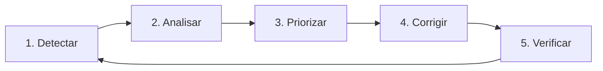

# 🎬 Vídeo 5.3 - Correção e Validação

**Aula**: 5 - DAST com OWASP ZAP  
**Vídeo**: 5.3  
**Temas**: Security Headers; Correção de vulnerabilidades; Ciclo de remediação

---

## 📚 Parte 1: Ciclo de Remediação

### Passo 1: O Ciclo Completo



> "Encontrar vulnerabilidades é só metade do trabalho!"

---

### Passo 2: Alertas Comuns do ZAP

| ID | Alerta | Severidade | Solução |
|----|--------|------------|---------|
| 10010 | Cookie No HttpOnly | Low | Adicionar flag HttpOnly |
| 10011 | Cookie Without Secure | Low | Adicionar flag Secure |
| 10021 | X-Content-Type-Options Missing | Low | Adicionar header |
| 10038 | CSP Header Not Set | Medium | Adicionar header CSP |

---

## 🔒 Parte 2: Security Headers

### Passo 3: O que são Security Headers?

**Security Headers** = Headers HTTP que protegem a aplicação

| Header | O que faz |
|--------|-----------|
| **X-Content-Type-Options** | Previne MIME sniffing |
| **X-Frame-Options** | Previne clickjacking |
| **X-XSS-Protection** | Filtro XSS do browser |
| **Content-Security-Policy** | Controla recursos carregados |
| **Strict-Transport-Security** | Força HTTPS |
| **Referrer-Policy** | Controla header Referer |

---

### Passo 4: Verificar Headers Atuais

**Linux/Mac:**
```bash
# Verificar headers da aplicação
curl -I http://localhost:5001

# Ou se estiver em staging
curl -I http://<STAGING_URL>
```

**Resultado esperado (sem headers):**
```
HTTP/1.1 200 OK
Content-Type: text/html; charset=utf-8
Content-Length: 1234
# Faltam os security headers!
```

---

## ✅ Parte 3: Implementar Correções

### Passo 5: Adicionar Headers no Flask

Edite o arquivo `app.py`:

```python
from flask import Flask, make_response

app = Flask(__name__)

# ============================================
# SECURITY HEADERS - Adicionar a TODAS as respostas
# ============================================
@app.after_request
def add_security_headers(response):
    # Previne MIME sniffing
    response.headers['X-Content-Type-Options'] = 'nosniff'
    
    # Previne clickjacking
    response.headers['X-Frame-Options'] = 'DENY'
    
    # Filtro XSS do browser
    response.headers['X-XSS-Protection'] = '1; mode=block'
    
    # Força HTTPS (em produção)
    response.headers['Strict-Transport-Security'] = 'max-age=31536000; includeSubDomains'
    
    # Content Security Policy básica
    response.headers['Content-Security-Policy'] = "default-src 'self'"
    
    # Controla Referer
    response.headers['Referrer-Policy'] = 'strict-origin-when-cross-origin'
    
    # Remove header que expõe tecnologia
    response.headers.pop('Server', None)
    
    return response
```

---

### Passo 6: Configurar Cookies Seguros

```python
from flask import Flask

app = Flask(__name__)

# ============================================
# COOKIE SECURITY
# ============================================
app.config.update(
    SESSION_COOKIE_SECURE=True,      # Só HTTPS
    SESSION_COOKIE_HTTPONLY=True,    # Não acessível via JS
    SESSION_COOKIE_SAMESITE='Lax',   # CSRF protection
)
```

---

### Passo 7: Verificar Headers Após Correção

**Linux/Mac:**
```bash
# Rebuild e restart
docker build --platform linux/amd64 -t app:fixed -f Dockerfile.secure .
docker stop app-test 2>/dev/null || true
docker rm app-test 2>/dev/null || true
docker run -d -p 5001:5000 --name app-test app:fixed

# Verificar headers
curl -I http://localhost:5001
```

**Resultado esperado (com headers):**
```
HTTP/1.1 200 OK
Content-Type: text/html; charset=utf-8
X-Content-Type-Options: nosniff
X-Frame-Options: DENY
X-XSS-Protection: 1; mode=block
Strict-Transport-Security: max-age=31536000; includeSubDomains
Content-Security-Policy: default-src 'self'
Referrer-Policy: strict-origin-when-cross-origin
```

---

## 🔄 Parte 4: Validar Correções

### Passo 8: Re-executar ZAP Local

**Linux/Mac:**
```bash
# ZAP Scan após correção
docker run -t ghcr.io/zaproxy/zaproxy:stable zap-baseline.py \
  -t http://host.docker.internal:5001
```

**Resultado esperado:**
```
PASS: X-Content-Type-Options Header [10021]
PASS: X-Frame-Options Header [10020]
PASS: Content Security Policy [10038]

FAIL-NEW: 0	WARN-NEW: 0	PASS: 48
```

---

### Passo 9: Commit e Deploy

**Linux/Mac:**
```bash
cd ~/fiap-devsecops/fiap-dclt-devsecops-aula05

git add app.py
git commit -m "fix: adicionar security headers"
git push origin main
```

---

### Passo 10: Re-executar Pipeline DAST

1. GitHub > **Actions**
2. **DAST Scan** > **Run workflow**
3. Comparar relatório com anterior

---

## 📊 Parte 5: Comparação Antes/Depois

### Passo 11: Comparar Resultados

| Métrica | Antes | Depois |
|---------|-------|--------|
| **High** | 0 | 0 |
| **Medium** | 2 | 0 |
| **Low** | 5 | 1 |
| **Info** | 8 | 3 |

---

## 🔧 Troubleshooting

| Erro | Causa | Solução |
|------|-------|---------|
| Headers não aparecem | Código não deployado | Rebuild e restart |
| CSP bloqueia recursos | Policy muito restritiva | Ajustar CSP |
| HSTS em dev | Não usar em HTTP | Condicional por ambiente |

---

## ✅ Checkpoint

Ao final deste vídeo você deve ter:

- [ ] Entender security headers
- [ ] Headers implementados no Flask
- [ ] Cookies configurados com flags seguras
- [ ] ZAP local mostrando menos alertas
- [ ] Código commitado
- [ ] Pipeline re-executado
- [ ] Comparar antes/depois

---

## 📖 Leitura Complementar

- [OWASP Secure Headers](https://owasp.org/www-project-secure-headers/)
- [MDN Security Headers](https://developer.mozilla.org/en-US/docs/Web/HTTP/Headers#security)
- [Security Headers Check](https://securityheaders.com/)

---

**FIM DO VÍDEO 5.3** ✅
